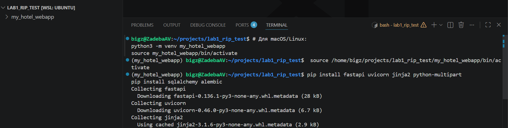
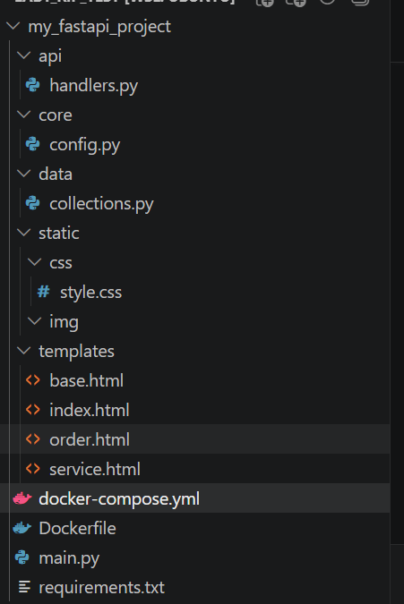
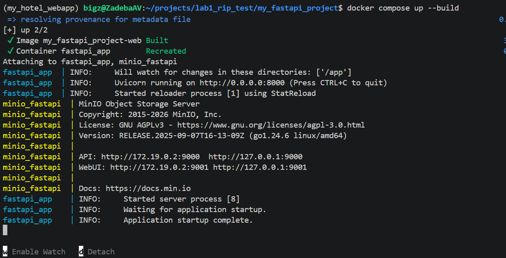
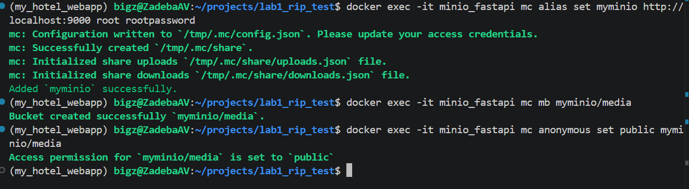
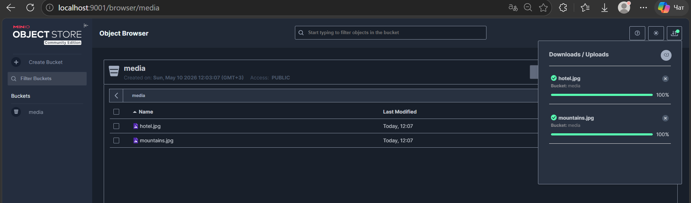
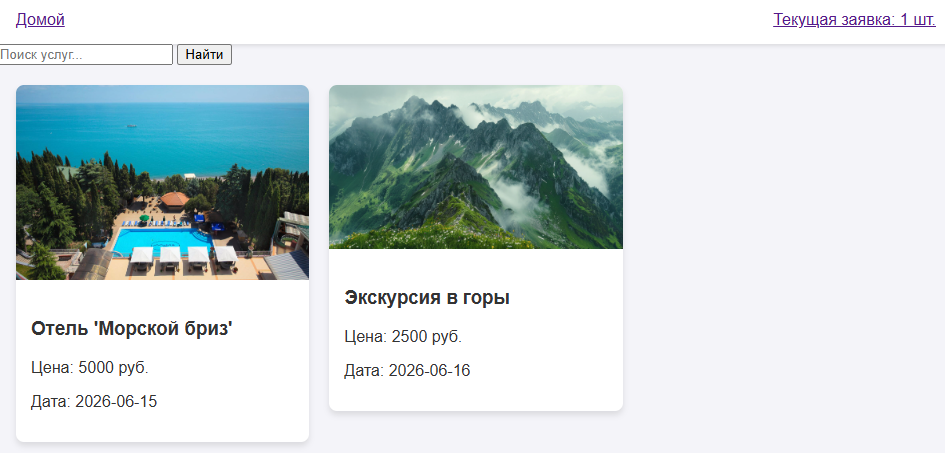
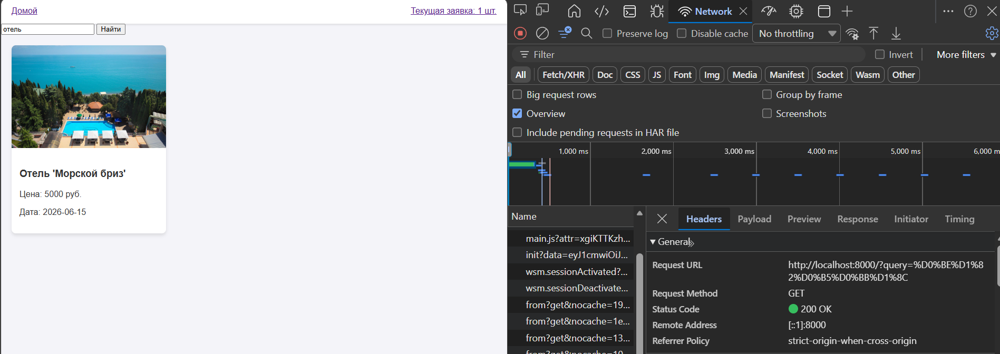
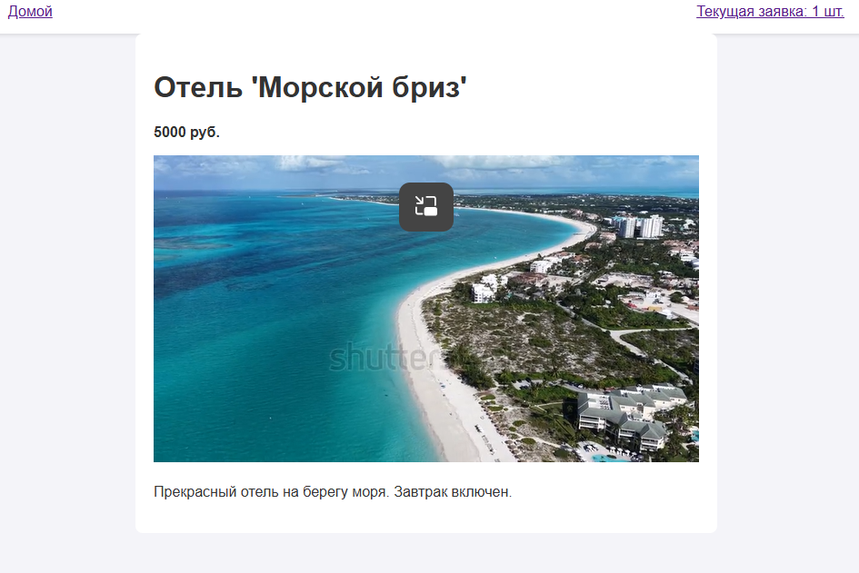
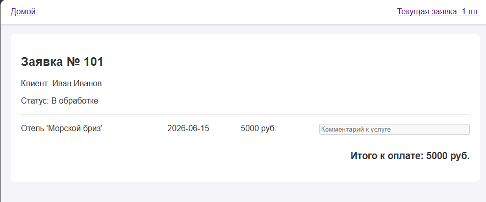

# Методические указания №1 FastAPI (Jinja2, SQLAlchemy, Alembic)

Для выполнения лабораторной работы потребуется установленный **Python 3.10+**, пакетный менеджер **pip**, редактор кода (рекомендуется **Visual Studio Code** или **PyCharm**) и установленный **Docker** (для запуска Minio).

В данной лабораторной работе мы познакомимся с основами построения бэкенда на современном фреймворке FastAPI, разберем базовую шаблонизацию, работу с роутингом и настроим S3-совместимое хранилище для статики.


## План работы

1. Подготовка окружения и немного теории
2. Структура проекта (Архитектура)
3. Развертывание Minio (через Minio Client)
4. Создание первого приложения на FastAPI
5. Шаблонизация с Jinja2 и подключение статики
6. Реализация коллекций данных и логики (Роутинг, Поиск, Куки)
7. FAQ


## 1. Подготовка окружения и немного теории

**FastAPI** — это современный, быстрый (высокопроизводительный) веб-фреймворк для создания API на Python 3.7+, в основе которого лежат стандартные аннотации типов Python. В отличие от Django или Flask, FastAPI изначально построен на асинхронной архитектуре (ASGI), что позволяет ему обрабатывать огромное количество запросов одновременно, соревнуясь в скорости с Node.js и Go.

Рекомендуется использовать виртуальное окружение, чтобы зависимости проекта не конфликтовали с глобальными пакетами операционной системы.

Откройте терминал, перейдите в папку будущего проекта и выполните команды:

```bash
# Создание виртуального окружения. 
# Вместо 'my_hotel_webapp' вы можете использовать любое свое название по теме проекта
python -m venv my_hotel_webapp
```

```bash
# Активация виртуального окружения (для Windows):
my_hotel_webapp\Scripts\activate
```

```bash
# Активация виртуального окружения (для macOS/Linux):
source my_hotel_webapp/bin/activate
```

Установим основные пакеты. В первой лабораторной мы не используем базу данных, но сразу подготовим стек (установим алхимию и алембик на будущее):

```bash
pip install fastapi uvicorn jinja2 python-multipart
pip install sqlalchemy alembic
```



**Создание файла requirements.txt**
Чтобы Docker в будущем мог установить те же самые библиотеки при сборке контейнера, нам нужно зафиксировать их в текстовый файл. Выполните команду сохранения зависимостей:

```bash
pip freeze > requirements.txt
```

После этого в корне проекта появится файл `requirements.txt` со списком всех установленных библиотек и их точными версиями.

## 2. Структура проекта (Архитектура)

Где положить файл? В современных веб-приложениях принято следовать паттернам, разделяющим логику (например, **MVC** — Model-View-Controller или **MVT** — Model-View-Template). Это позволяет не превращать код в «спагетти».

* **Модели (Data/Models):** Отвечают за структуру данных и связь с БД.
* **Контроллеры/Роутеры (API/Handlers):** Принимают HTTP-запросы, вызывают нужную логику и возвращают ответ.
* **Представления (Templates):** Отвечают за то, как данные будут показаны пользователю (HTML).

Создайте следующую структуру папок и файлов:



## 3. Развертывание Minio (Docker Compose и объектное хранилище)

**Немного теории: Что такое Minio и зачем оно нам?**
В классических веб-приложениях файлы часто хранили прямо в папке с кодом (на жестком диске сервера). Это создавало проблемы: сервер переполнялся, а при запуске нескольких копий приложения файлы рассинхронизировались.
Современный подход — использование **Объектных хранилищ (Object Storage)**, таких как Amazon S3. В них файлы хранятся не в виде иерархии папок, а как объекты с уникальными идентификаторами (ключами) и метаданными. **Minio** — это S3-совместимое хранилище, которое можно развернуть локально. Оно идеально подходит для отдачи «тяжелых» медиафайлов: изображений, видео, бэкапов.

Вместо того чтобы запускать всё вручную, мы используем **Docker Compose**, который поднимет и наше приложение, и S3-хранилище Minio одной командой.

Создайте файл `Dockerfile` для сборки нашего FastAPI:

```dockerfile
# Используем легковесный образ Python 3.10
FROM python:3.10-slim

# Устанавливаем рабочую директорию внутри контейнера
WORKDIR /app

# Копируем файл зависимостей и устанавливаем их
COPY requirements.txt .
RUN pip install --no-cache-dir -r requirements.txt

# Копируем весь остальной код проекта
COPY . .

# Открываем порт 8000 для uvicorn
EXPOSE 8000

# Команда для запуска FastAPI сервера
CMD ["uvicorn", "main:app", "--host", "0.0.0.0", "--port", "8000"]

```

Создайте `docker-compose.yml` в корне проекта:

```yaml
services:
  # Наш FastAPI бэкенд
  web:
    build: .
    container_name: fastapi_app
    ports:
      - "8000:8000"
    depends_on:
      - minio
    # Монтируем текущую папку внутрь контейнера, чтобы код обновлялся без пересборки образа
    volumes:
      - .:/app
    # Запускаем с флагом --reload для разработки
    command: uvicorn main:app --host 0.0.0.0 --port 8000 --reload

  # Объектное хранилище Minio
  minio:
    container_name: minio_fastapi
    image: minio/minio:latest
    ports:
      - "9000:9000"
      - "9001:9001"
    environment:
      MINIO_ROOT_USER: root
      MINIO_ROOT_PASSWORD: rootpassword
      MINIO_CONSOLE_ADDRESS: ":9001"
    volumes:
      - minio-data:/data
    command: server /data --console-address ":9001"

volumes:
  minio-data:

```

### Запуск и настройка инфраструктуры

1. Соберите и запустите проект в фоновом режиме(для отладки необходимо убрать `-d` флаг):

    ```bash
    docker compose up --build -d
    ```
    Теперь наше приложение будет автоматически развернуто внутри контейнера Докера, отдельно запускать `main.py` не придется:
    
>**NB!** Обратите внимание: сначала надо написать весь код проекта, потом уже запускать контейнер, иначе вы не запустите сервер -- только пространство MinIO будет доступно по ранее заданному порту

2. **Настройка публичного доступа через Minio Client (`mc`):**
По умолчанию корзины (бакеты) в Minio приватны. Выполните эти команды по очереди, чтобы создать бакет и сделать его публичным:

    ```bash
    # Подключаем клиента к серверу Minio(minio_fastapi - название контейнера из docker-compose.yml)
    docker exec -it minio_fastapi mc alias set myminio http://localhost:9000 root rootpassword
    ```

    ```bash
    # Создаем бакет. 'media' вы можете заменить на название вашей темы (например, 'hotel-assets', 'images')
    docker exec -it minio_fastapi mc mb myminio/media
    ```

    ```bash
    # Делаем бакет публичным для чтения. Обязательно замените 'media', если на предыдущем шаге выбрали другое имя!
    docker exec -it minio_fastapi mc anonymous set public myminio/media
    ```

3. **Загрузка файлов:**
Зайдите по адресу `http://localhost:9001` (логин `root`, пароль `rootpassword`), перейдите в бакет `media` (или тот, который вы создали) и загрузите туда изображения и видео для услуг. Ссылки на них будут выглядеть так: `http://localhost:9000/media/ваша_картинка.jpg`.



3. **Проверка работы и загрузка файлов:**
* Перейдите в веб-интерфейс Minio: `http://localhost:9001`
* Авторизуйтесь (`root` / `rootpassword`).
* Загрузите картинки в созданный бакет `media` через веб-интерфейс. Теперь они доступны вашему приложению по прямым ссылкам вида: `http://localhost:9000/media/ваша_картинка.jpg`.


4. **Остановка хранилища (при необходимости):**
    ```bash
    docker compose down
    ```


Вид хранилища с загружеными изображениями:



## 4. Создание первого приложения на FastAPI

Файл `main.py` должен содержать минимум логики — это точка сборки нашего приложения. Мы инициализируем экземпляр `FastAPI` и подключаем к нему статику и роутеры.

Откроем `main.py` и напишем:

```python
from fastapi import FastAPI
from fastapi.staticfiles import StaticFiles
import uvicorn
from api.handlers import router

app = FastAPI(title="Web Application Lab")

# Подключаем папку со статикой (CSS, шрифты, локальные иконки)
# Теперь файлы из папки static будут доступны по URL /static/...
app.mount("/static", StaticFiles(directory="static"), name="static")

# Подключаем наши роуты (контроллеры) из файла handlers.py
app.include_router(router)

if __name__ == "__main__":
    # Запуск ASGI-сервера на порту 8000
    # reload=True позволяет автоматически перезапускать сервер при изменении кода
    uvicorn.run("main:app", host="127.0.0.1", port=8000, reload=True)

```


## 5. Шаблонизация с Jinja2 и подключение статики

**Статика vs Динамика:** **Статические файлы** (CSS, JS, логотипы) отдаются сервером в неизменном виде.

* **Шаблоны** (HTML + Jinja2) обрабатываются сервером: в них подставляются переменные, выполняются циклы (`for`) и условия (`if`), и только потом готовый HTML отправляется в браузер клиента.

Создадим базовый шаблон `templates/base.html`, от которого будут наследоваться остальные страницы (принцип DRY - Don't Repeat Yourself).

```html
<!DOCTYPE html>
<html lang="ru">
<head>
    <meta charset="UTF-8">
    <meta name="viewport" content="width=device-width, initial-scale=1.0">
    <title>Главная</title>
    <link rel="stylesheet" href="{{ url_for('static', path='css/style.css') }}">
</head>
<body>
    <header>
        <a href="/" class="home-btn">Домой</a>
        <div class="cart-info">
            <a href="/order/{{ order_id }}">
                Текущая заявка: {{ order_items_count }} шт.
            </a>
        </div>
    </header>

    <main>
        
        
    </main>
</body>
</html>
```

### Написание CSS

В файл `static/css/style.css` добавьте стили, скопировав их с выбранного сайта-референса (цвета, hover-эффекты, сетка).

Пример базовой CSS-сетки для карточек:

```css
body {
    font-family: Arial, sans-serif;
    background-color: #f4f4f9; 
    color: #333;               
    margin: 0;
}

header {
    background-color: #ffffff;
    padding: 15px 20px;
    display: flex;
    justify-content: space-between;
    box-shadow: 0 2px 4px rgba(0,0,0,0.1);
}

.services-grid {
    display: grid;
    grid-template-columns: repeat(3, 1fr); /* Плитка в 3 столбца */
    gap: 20px;
    padding: 20px;
}

.service-card {
    background: white;
    border-radius: 8px;
    box-shadow: 0 4px 6px rgba(0,0,0,0.1);
    transition: transform 0.2s ease-in-out; 
    cursor: pointer;
}

.service-card:hover {
    transform: translateY(-5px);
}

```

## 6. Реализация коллекций данных и логики (Роутинг, Поиск, Куки)

### Словари и списки данных (вместо БД)

Пока мы не подключили SQLAlchemy, мы используем структуры данных Python (Списки и Словари). Это позволит понять, как данные передаются из контроллера в шаблон.

В файле `data/collections.py`:

```python
# Коллекция услуг. URL картинок ведут на наш локальный Minio
services_db = [
    {
        "id": 1,
        "title": "Отель 'Морской бриз'",
        "price": 5000,
        "date": "2026-06-15",
        "description": "Прекрасный отель на берегу моря. Завтрак включен.",
        "image_url": "http://localhost:9000/media/hotel1.jpg",
        "video_url": "http://localhost:9000/media/hotel1_video.mp4"
    },
    {
        "id": 2,
        "title": "Экскурсия в горы",
        "price": 2500,
        "date": "2026-06-16",
        "description": "Дневной поход с гидом. Уровень сложности: средний.",
        "image_url": "http://localhost:9000/media/mountains.jpg",
        "video_url": None
    },
]

# Словарь заявок
order_db = {
    "101": {
        "id": 101,
        "user_name": "Иван Иванов",
        "items": [services_db[0]], # Имитируем, что в корзине уже есть 1 товар
        "status": "В обработке"
    }
}

```

### Контроллеры (Роуты) и Фильтрация

HTTP GET-запрос используется для получения данных. Параметры могут передаваться в пути (Path), например `/service/1`, или в строке запроса (Query), например `/?query=Отель`.

Откройте `api/handlers.py`. Здесь мы считываем Cookie, чтобы идентифицировать пользователя, и реализуем логику фильтрации списка.

```python
from fastapi import APIRouter, Request, Cookie, Query
from fastapi.templating import Jinja2Templates
from typing import Optional
from data.collections import services_db, order_db

router = APIRouter()
# Указываем FastAPI, где искать HTML файлы
templates = Jinja2Templates(directory="templates")

# Вспомогательная функция для получения id корзины из Cookie
def get_current_order_id(order_cookie: str = None) -> str:
    return order_cookie if order_cookie else "101"

@router.get("/")
def list_services(
    request: Request, 
    query: Optional[str] = Query(None), # Query-параметр для поиска
    order_id: Optional[str] = Cookie(None) # Cookie-параметр
):
    current_order_id = get_current_order_id(order_id)
    order = order_db.get(current_order_id, {"items": []})
    
    # Реализация фильтрации (поиска)
    filtered_services = services_db
    if query:
        filtered_services = [
            s for s in services_db 
            if query.lower() in s["title"].lower()
        ]

    return templates.TemplateResponse(
        request=request,
        name="index.html", 
        context={
            "services": filtered_services,
            "query": query or "",
            "order_id": current_order_id,
            "order_items_count": len(order["items"])
        }
    )

@router.get("/service/{service_id}")
def get_service_detail(
    request: Request, 
    service_id: int, # Path-параметр
    order_id: Optional[str] = Cookie(None)
):
    current_order_id = get_current_order_id(order_id)
    order = order_db.get(current_order_id, {"items": []})
    
    # Ищем конкретную услугу по ID
    service = next((s for s in services_db if s["id"] == service_id), None)
    
    return templates.TemplateResponse(
        request=request,
        name="service.html", 
        context={
            "service": service,
            "order_id": current_order_id,
            "order_items_count": len(order["items"])
        }
    )

@router.get("/order/{order_id}")
def get_order_detail(request: Request, order_id: str):
    order = order_db.get(order_id)
    
    # Динамическое вычисление итоговой цены (Бизнес-логика)
    total_price = sum(item["price"] for item in order["items"]) if order else 0
    
    return templates.TemplateResponse(
        request=request,
        name="order.html", 
        context={
            "order": order,
            "order_id": order_id,
            "order_items_count": len(order["items"]) if order else 0,
            "total_price": total_price
        }
    )
```

### Шаблоны страниц

**Страница 1:** `templates/index.html`

```html



    <form action="/" method="GET" class="search-form">
        <input type="text" name="query" placeholder="Поиск услуг..." value="{{ query }}">
        <button type="submit">Найти</button>
    </form>

    <div class="services-grid">
        
        <a href="/service/{{ service.id }}" class="card-link" style="text-decoration: none; color: inherit;">
            <div class="service-card">
                
                <div style="padding: 15px;">
                    <h3>{{ service.title }}</h3>
                    <p>Цена: {{ service.price }} руб.</p>
                    <p>Дата: {{ service.date }}</p>
                </div>
            </div>
        </a>
        
            <p>По вашему запросу ничего не найдено.</p>
        
    </div>

```
Главная страница теперь имеет вид:


При выполнении поиска у вас будет отображен GET запрос на вкладке Network в меню разработчика (F12 для перехода)


**Страница 2:** `templates/service.html`
>**NB!:** У вас страница подробнее с помощью CSS стилей должна быть отображена в формате wibes WB(видео формата 9:16 с наложенным текстом подробнее об услуге и дополнительной информации по теме)
```html



    <div class="service-detail-portrait" style="max-width: 600px; margin: 0 auto; background: white; padding: 20px; border-radius: 8px;">
        <h1>{{ service.title }}</h1>
        <p class="price"><strong>{{ service.price }} руб.</strong></p>
        
        
        <video width="100%" autoplay loop muted>
            <source src="{{ service.video_url }}" type="video/mp4">
            Ваш браузер не поддерживает видео.
        </video>
        
        
        
        
        <p class="desc" style="margin-top: 20px;">{{ service.description }}</p>
    </div>

```


**Страница 3:** `templates/order.html`

```html



    <div style="background: white; padding: 20px; border-radius: 8px; margin: 20px;">
        <h2>Заявка № {{ order.id }}</h2>
        <p>Клиент: {{ order.user_name }}</p>
        <p>Статус: {{ order.status }}</p>
        <hr>
        
        <div class="order-items-list">
            
            <div class="order-item-row" style="display: flex; justify-content: space-between; padding: 10px 0; border-bottom: 1px solid #eee;">
                <span class="item-title" style="flex: 2;">{{ item.title }}</span>
                <span class="item-date" style="flex: 1;">{{ item.date }}</span>
                <span class="item-price" style="flex: 1;">{{ item.price }} руб.</span>
                
                <input type="text" class="mm-field" placeholder="Комментарий к услуге" disabled style="flex: 2; margin-left: 10px;">
            </div>
            
        </div>

        <div class="total-calc" style="text-align: right; margin-top: 20px;">
            <h3>Итого к оплате: {{ total_price }} руб.</h3>
        </div>
    </div>

```
Страница корзины:


---

## 7. FAQ

**Где изучить больше по FastAPI?**
Существует прекрасная официальная документация по фреймворку: [https://fastapi.tiangolo.com/](https://www.google.com/search?q=https://fastapi.tiangolo.com/)

**Почему мы не использовали БД (SQLAlchemy) в первой лабораторной?**
По требованиям задания №1, мы знакомимся с архитектурой, роутингом, шаблонизацией и дизайном интерфейсов. Данные должны храниться атомарно прямо в коде. Подключение базы данных с помощью SQLAlchemy и системы миграций Alembic будет производиться в следующих лабораторных работах на уже подготовленный в рамках этого этапа фундамент.

**Почему в main.py указан host 127.0.0.1, а в Docker Compose — 0.0.0.0?**
Когда вы запускаете сервер локально без Докера, 127.0.0.1 (localhost) безопасен и доступен только с вашего компьютера. Однако внутри Docker-контейнера своя изолированная сеть. Если запустить сервер на 127.0.0.1 внутри контейнера, он будет недоступен снаружи (из вашего браузера). Указание 0.0.0.0 говорит серверу слушать запросы со всех сетевых интерфейсов, позволяя пробросить порт 8000 наружу.